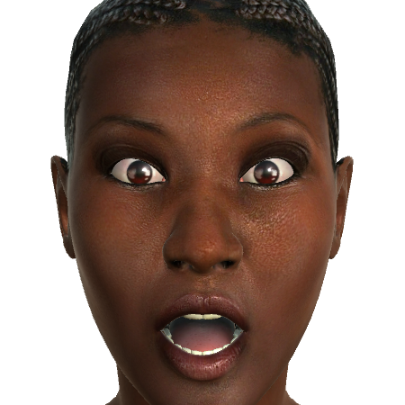
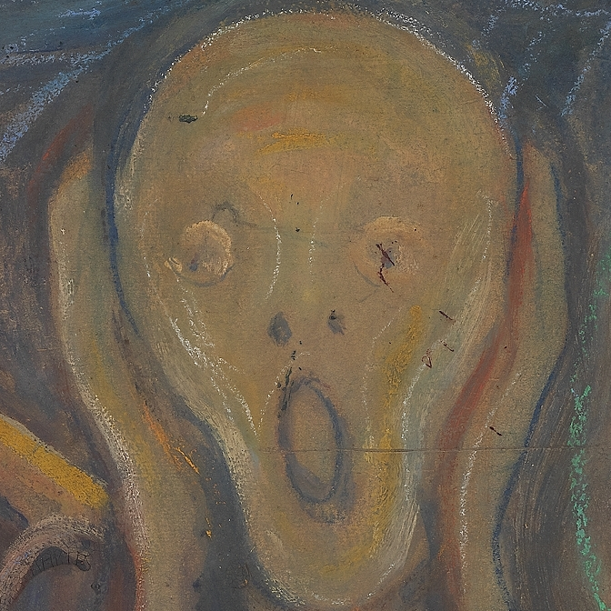
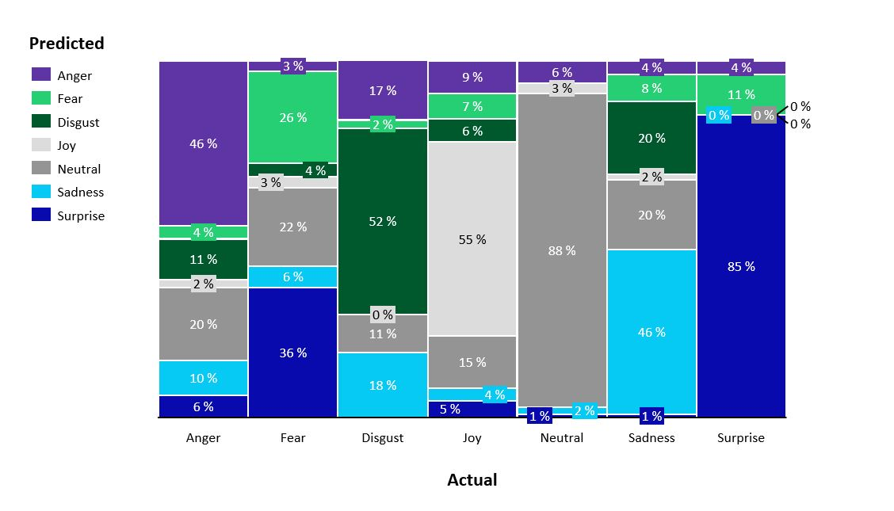

# Análisis de un modelo de reconocimiento de emociones con la herramienta LIME

Autores: 

- Ramón Rotaeche Fernández de la Riva
- Lluís Bernat Ladaria

## Introducción

Se nos ha proporcionado una red neuronal entrenada 
con un conjunto de caras que expresan las 6 emociones 
básicas más la neutra. 

Deseamos obtener una explicación de los elementos que componen las 
imágenes que nos permita saber en que se fija 
la red neuronal proporcionada para dirimir que emoción 
se está expresando. 
Es decir, queremos averigüar que partes de las caras 
son las que más contribuyen en cada probabilidad que calcula la red. 

## Requisitos

Son necesarias las siguientes librerias y sus dependencias: 

- keras
- lime
- abind
- magick
- lattice
- ggplot2
- gdata
- caret
- e1071
- pillow (`pip install pillow`)
- SciPy (`pip install SciPy`)

# Pruebas LIME con la red neuronal

En los siguientes apartados vamos a experimentar 
con la red neuronal suministrada. 
De las dos opciones que se nos han ofrecido, 
hemos decidido usar la entrenada con las *caras recortadas* 
por arrojar una precisión un poco mejor que la original. 

## Metodología

Suministraremos a la red entrenada una selección de caras 
del conjunto de pruebas 
que expresarán algunas emociones de nuestro interés. 
Por cada una de las caras suministradas, la red generará 
un conjunto de probabilidades correspondientes a cada 
una de las posibles emociones. 

En cada caso, se usará la herramienta LIME 
(Local Interpretable Model-Agnostic Explanations) 
para conseguir el conjunto de explicaciones 
que se consideren más ilustrativas. 
Comentaremos los resultados obtenidos, destacando 
lo singular por encima de lo esperado. 

También comentaremos los resultados de la encuesta 
sobre discernimiento de emociones que se hizo a 
los alumnos. 

## Carga de la red neuronal

Vamos a cargar el modelo de red neuronal 
ya entrenado con el *dataset* de caras recortadas. 

```{r}
library(keras)

# Trayectoria de la serialización del modelo
model_path = "../data/model/model7Emociones.h5"
# Carga del modelo HDF5
model <- load_model_hdf5(
  model_path,
  custom_objects= NULL,
  compile = TRUE
  )
```

## Preparación de las caras 

Además de cargar la red en el apartado anterior, 
vamos a comprobar que todo funciona, 
pasando por la red todas las caras de prueba y examinando 
brevemente las probabilidades generadas. 

Por tanto este apartado y el siguiente son opcionales, 
aunque los hemos introducido para guardarlos como referencia 
futura. 

```{r}
# Trayectoria del conjunto de imágenes de test
images_path = "../data/test_crop/"

# Preparaciónde las imágenes: Imágenes normalizadas en escala de grises de tamaño 128x128
## Genera lotes de imágenes con data aumentation en tiempo real 
datagen <- image_data_generator(rescale= 1/255 # Normalización de las imágenes entre 0 y 1
                                )
## Genera lotes de imágenes a partir de un directorio 
test_generator <- flow_images_from_directory(
  directory = images_path, # Debe contener un subdirectorio por clase
  generator = datagen, 
  color_mode = "grayscale", # Las imágenes se convertirán para tener 1 canal de color
  target_size = c(128, 128), # Las imágenes se redimensionarán a 128 x 128
  class_mode= "categorical", # 2D one-hot encoded labels
  batch_size=1, # Lotes formados por 1 imagen 
  shuffle= FALSE # Sin aleatorización
  )
```

## Evaluación de las predicciones

```{r warning=FALSE}
# Realización de las predicciones
## Generación de predicciones a partir de un generador de datos
STEP_SIZE = 
  test_generator$n/test_generator$batch_size
prediction <- model %>% predict_generator(
  # Generador que produce lotes de imágenes
  generator = test_generator, 
  # Número total de pasos (lotes de imágenes) a proporcionar por el generador antes de detenerse
  steps = STEP_SIZE)
head(prediction)
labels <- unlist(test_generator$class_indices)
print(labels)
```

## Preparativos LIME 

```{r}
library(lime)
library(abind)

# Necesitamos pasa a LIME un ítem cualquiera del mismo tipo de los que le pediremos explicaciones. 
# En nuestro caso le pasamos una imágen del conjunto de test
sample_path = '../data/test_crop/JOY/Wanda_IngratiatingSmile.png'

# Definimos la función que vamos a utilizar para preparar las imágenes para el modelo.

# Transforma un vector de caracteres al formato que espera el modelo (imágenes normalizadas en escala de grises de tamaño 128x128): para cada imagen creamos un array unidimensional en row-major order con el número de canales al final y lo normalizamos entre 0 y 1
img_preprocess <- function(x) {
  arrays <- lapply(x, function(path) {
    img <- image_load(path, grayscale = TRUE, target_size = c(128, 128))
    x <- image_to_array(img, data_format = "channels_last")
    x <- array_reshape(x, c(1, dim(x)))
    x <- x/255.0
    }
    )
  do.call(abind, c(arrays, list(along = 1)))
}

# Creamos un explicador con LIME a partir de nuestro modelo y con nuestras etiquetas
explainer <- lime(
  x = sample_path,
  model = as_classifier(model, labels = names(labels)),
  preprocess = img_preprocess
  )

```

## Cara número 1: alegría

Vamos a analizar una imágen con la etiqueta alegría 


```{r}
explain_img_path = '../data/test_crop/JOY/Wanda_IngratiatingSmile.png'

res <- predict(model, img_preprocess(explain_img_path))
colnames(res) <- names(labels)
print(res)
```

```{r}
library(magick)
n_superpixels = 20

# Mostraremos los superpixels para poder evaluar cuáles son las zonas que se utilizan antes de aplicar la función de explicación.
# Un superpixel és cada una de las zonas en las que se segmenta la imagen para facilitar las explicaciones en los modelos que utilizan imágenes.
# Estos superpíxeles deberían contener patrones específicos de la imagen, por ello visualizarlos nos puede dar una idea de las zonas que se utilizan para la explicación.
# Tenemos que tener en cuenta que si las características importantes de la imagen se cortan en demasiados segmentos podemos obtener un modelo incorrecto para la explicación.
# Cuanto más grande sea el objeto que buscamos en relación al tamaño de la imagen, menos superpíxeles debería haber.
plot_superpixels(explain_img_path, n_superpixels)
```

```{r}
# Generación de la explicación
explanation <- explain(
  explain_img_path,
  explainer,
  n_labels = 2,
  n_features = 3 * n_superpixels %/% 4, #  limitamos el cardinal del conjunto de features para la explicación a 3/4 del número de superpíxeles
  n_superpixels = n_superpixels)
# Visualización de los resultados
plot_image_explanation(as.data.frame(explanation))
```

```{r}
plot_image_explanation(as.data.frame(explanation),
                       display = 'block', 
                       show_negative = TRUE)
```


```{r}
# Se puede precisar un poco más mostrando la gráfica de los pesos de las características para establecer un umbral (threshold) adecuado:
library(ggplot2)
explanation %>% 
  ggplot(aes(x = feature_weight)) + 
  facet_wrap(~ case, scales = "free") + 
  geom_density()
```

```{r}
plot_image_explanation(as.data.frame(explanation),
                       display = 'block', 
                       show_negative = TRUE,
                       threshold = 0.06)
```

### Conclusiones cara 1

Hemos elegido este caso porque nos ha parecido una expresión que arrastraba una cierta
melancolía y queríamos saber si la red neuronal lo clasificaría con probabilidades bajas. 

Si bien parece que la red lo tiene medianamente claro, pues afirma con un 100% de probabilidad 
que Wanda está alegre.  

La puntuación de alegría se ve favorecida por la configuración de labios y barbilla 
(como parecería lógico) 
y extrañamente también por una parte importante del cuello. 
En el caso presentado la nariz y el ojo izquierdo puntúan en contra. 
Suponemos que es la forma que ha encontrado la red de darnos parte de razón en 
que la expresión de alegría de Wanda podría ser más expresiva. 

La valoración de expresión neutral se ve favorecida por los ojos 
(seguimos pensando que melancólicos) y nariz. 
Sin embargo el flequillo parece ir en contra. 

## Cara número 2: sorpresa

Vamos a analizar una imágen con la expresión de sorpresa. 



```{r}
explain_img_path = '../data/test_crop/SURPRISE/Simona_Surprise.png'

res <- predict(model, img_preprocess(explain_img_path))
colnames(res) <- names(labels)
print(res)
```

```{r}
library(magick)
n_superpixels = 40

# Mostraremos los superpixels para poder evaluar cuáles son las zonas que se utilizan antes de aplicar la función de explicación.
# Un superpixel és cada una de las zonas en las que se segmenta la imagen para facilitar las explicaciones en los modelos que utilizan imágenes.
# Estos superpíxeles deberían contener patrones específicos de la imagen, por ello visualizarlos nos puede dar una idea de las zonas que se utilizan para la explicación.
# Tenemos que tener en cuenta que si las características importantes de la imagen se cortan en demasiados segmentos podemos obtener un modelo incorrecto para la explicación.
# Cuanto más grande sea el objeto que buscamos en relación al tamaño de la imagen, menos superpíxeles debería haber.
plot_superpixels(explain_img_path, n_superpixels)
```

```{r}
# Generación de la explicación
explanation <- explain(
  explain_img_path,
  explainer,
  n_labels = 2,
  n_features = 3 * n_superpixels %/% 4, # limitamos el cardinal del conjunto de features para la explicación a 3/4 del número de superpíxeles
  n_superpixels = n_superpixels)
# Visualización de los resultados
plot_image_explanation(as.data.frame(explanation))
```

```{r}
plot_image_explanation(as.data.frame(explanation),
                       display = 'block', 
                       show_negative = TRUE)
```


```{r}
# Se puede precisar un poco más mostrando la gráfica de los pesos de las características para establecer un umbral (threshold) adecuado:
library(ggplot2)
explanation %>% 
  ggplot(aes(x = feature_weight)) + 
  facet_wrap(~ case, scales = "free") + 
  geom_density()
```

```{r}
plot_image_explanation(as.data.frame(explanation),
                       display = 'block', 
                       show_negative = TRUE,
                       threshold = 0.03)
```

### Conclusiones cara 2: sorpresa 

En este caso, parece que para decidir sorpresa (77%) es suficiente fijarse 
en la apertura de la boca. 
Sin embargo la apreciación de miedo requiere revisar zonas como 
la barbilla, una parte del labio, ojos, cejas y algo de frente. 

Llama la atención que la red se fije principalmente en la abertura de la boca 
para decidir sorpresa y en cambio considere casi toda la cara 
para decidor miedo (con un 23% de probabilidad). 

## Bonus: El grito (E. Munch)

En este pequeño *bonus* hemos querido experimentar con una de las obras 
maestras de la pintura nórdica expresionista. 
Evidentemente el experimento (más bien un juego) 
carece de rigor pues la red 
no ha sido entrenada para reconocer emociones en esta tesitura. 

Han podido más el interés por aprender y la curiosidad que la prudencia.



```{r}
explain_img_path = '../data/munch/the_scream.png'

res <- predict(model, img_preprocess(explain_img_path))
colnames(res) <- names(labels)
print(res)
```

```{r}
library(magick)
n_superpixels = 46

# Mostraremos los superpixels para poder evaluar cuáles son las zonas que se utilizan antes de aplicar la función de explicación.
# Un superpixel és cada una de las zonas en las que se segmenta la imagen para facilitar las explicaciones en los modelos que utilizan imágenes.
# Estos superpíxeles deberían contener patrones específicos de la imagen, por ello visualizarlos nos puede dar una idea de las zonas que se utilizan para la explicación.
# Tenemos que tener en cuenta que si las características importantes de la imagen se cortan en demasiados segmentos podemos obtener un modelo incorrecto para la explicación.
# Cuanto más grande sea el objeto que buscamos en relación al tamaño de la imagen, menos superpíxeles debería haber.
plot_superpixels(explain_img_path, n_superpixels)
```

```{r}
# Generación de la explicación
explanation <- explain(
  explain_img_path,
  explainer,
  n_labels = 2,
  n_features = 3 * n_superpixels %/% 4, # limitamos el cardinal del conjunto de features para la explicación a 3/4 del número de superpíxeles
  n_superpixels = n_superpixels)
# Visualización de los resultados
plot_image_explanation(as.data.frame(explanation))
```

```{r}
plot_image_explanation(as.data.frame(explanation),
                       display = 'block', 
                       show_negative = TRUE)
```


```{r}
# Se puede precisar un poco más mostrando la gráfica de los pesos de las características para establecer un umbral (threshold) adecuado:
library(ggplot2)
explanation %>% 
  ggplot(aes(x = feature_weight)) + 
  facet_wrap(~ case, scales = "free") + 
  geom_density()
```

```{r}
plot_image_explanation(as.data.frame(explanation),
                       display = 'block', 
                       show_negative = TRUE,
                       threshold = 0.07)
```

### Conclusiones bonus

En este caso lo que llama poderosamente la atención es que la red 
esté segura al 98% de que el famoso cuadro de Munch es un grito de alegría, 
lo cual sería toda una bomba informativa en los círculos de arte. 

A parte de esto, poco tenemos que decir, pues se trata como ya hemos 
mencionado de un juego más que un experimento o valoración. 

Esperamos que os haya gustado y divertido. 

# Apéndice

# Antecedentes: el experimento en clase

Durante una sesión práctica se encuestó a los alumnos 
para saber cuan buenos reconocedores de emociones son. 
En el siguiente apartado se muestra la matriz de confusión 
del resultado de la prueba.

## Matriz de confusión de las respuestas de la clase

```{r}
library(gdata)

# Importamos el fichero CSV
data = read.csv("../data/csv/Respuestas_emociones.csv", stringsAsFactors= FALSE)

# Muestra la estructura interna del objeto
str(data)

# 'data.frame':880 obs. of  2 variables:
#  $ actual   : chr"Anger" "Anger" "Anger" "Anger" ...
#  $ predicted: chr"Anger" "Anger" "Fear" "Joy" ...

library(caret)

# creamos la matriz de confusión
confusionMatrix(
  # un factor de clases predichas
  data = as.factor(data$predicted), 
  # un factor de clases que se utilizará como resultados verdaderos
  reference = as.factor(data$actual)
  )
```
Una representación más visual:




## Observaciones del resultado de la encuesta en clase

* El accuracy medio de los alumnos es aproximadamente un 56%, creemos que esta precisión tan baja para un humano puede ser debida a dos factores: 
- 1) falta de contexto, pues se trata de imágenes no animadas y sin mayor información que la puramente gráfica
- 2) Falta de referencias, es decir, ninguna de las personas encuestadas conocía previamente las expresiones de los avatares expuestos

* Los alumnos son "conservadores" a la hora de identificar emociones. La etiqueta más puesta por los alumnos, con diferencia, es "Neutral" (209 asignaciones, seguida de "Sorpresa" con 175 asignaciones). Entendemos que los alumnos ponen esta etiqueta cuando no ven que la cara esté transmitiendo ninguna emoción. Sería interesante comprobar si el modelo, para aquellas emociones que los alumnos clasifican erróneamente como "Neutral", les asigna una emoción pero con una probabilidad más alejada del 100% (es decir, si las emociones en las que el modelo "duda" más, son las que los alumnos clasifican como neutral)

* "Neutral", "Sorpresa" y "Alegría" son las emociones en las que más han acertado los alumnos (accuracy del 88%, 85% y 55%). Mientras que "Miedo", "Enfado" y "Disgusto" son en las que más hemos fallado. A lo mejor es cierto eso que dicen de que *millenials* y *Generación Z* nos hemos criado entre algodones, hasta el punto que no estamos familiarizados ni sabemos reconocer las emociones negativas ;-).


